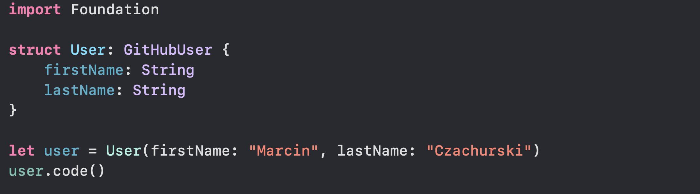

## Hi there 👋

My name is Marcin and I'm a software developer since almost two decades. I'm working mostly on enterprise applications (C#/Typescript), however in my free time I'm creating applications for iOS and macOS in my favorite language: Swift. I live in Wrocław/Poland with my lovely wife and daughter.

You can find me also on:

<a href="https://mczachurski.dev" target="_blank" aria-label="Website" rel="noopener">https://mczachurski.dev</a>

<a rel="me" href="https://mastodon.social/@mczachurski" target="_blank" aria-label="Mastodon">https://mastodon.social/@mczachurski</a>

<a href="https://vernissage.photos/@mczachurski" target="_blank" aria-label="Vernissage" rel="noopener">https://vernissage.photos/@mczachurski</a>

### Github statistics

### Pinned repositories

### Languages

